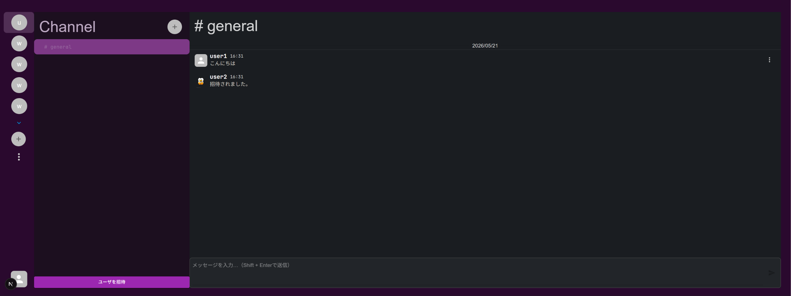
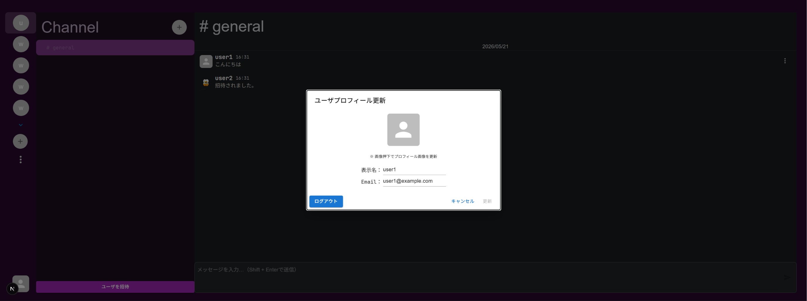
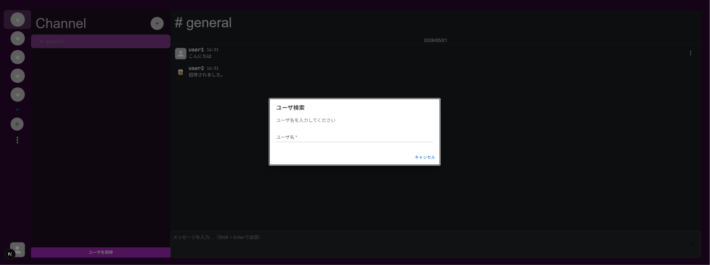
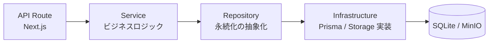
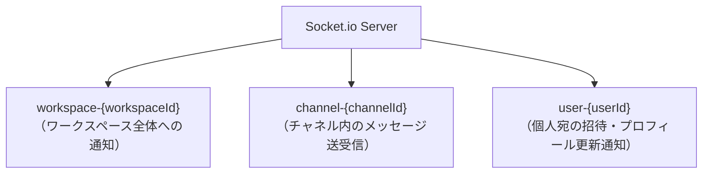
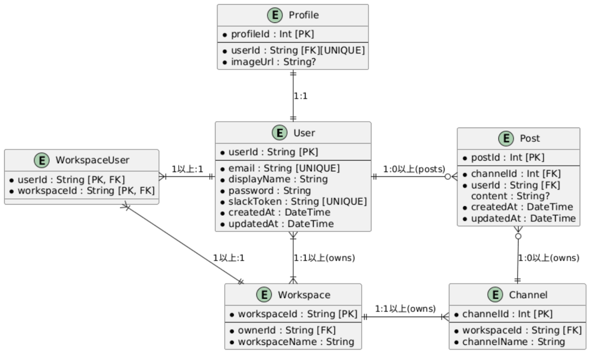

# Copy Slack


## アプリ概要

Socket.io によるリアルタイム通信と、依存性の逆転を取り入れたレイヤードアーキテクチャで構築した Slack 風チャットアプリです。<br />
実務で求められる設計（レイヤー分離・インターフェース抽象化・MSW を用いたテスト戦略）を一貫して意識しながら実装しています。

> **ローカルで30秒起動**: Docker 不要 → [Quick Start](#quick-start)

### スクリーンショット

|                 ログイン                 |      チャンネル / リアルタイムメッセージ       |
| :--------------------------------------: | :--------------------------------------------: |
|  |  |

|                   プロフィール更新                   |                    ユーザー招待                     |
| :--------------------------------------------------: | :-------------------------------------------------: |
|  |  |

### 技術スタック

| カテゴリ               | 技術・ツール                                                                               |
| :--------------------- | :----------------------------------------------------------------------------------------- |
| **フロントエンド**     | TypeScript, Next.js 16 (App Router), React 19, Material-UI, React Hook Form, Zod           |
| **バックエンド**       | Next.js API Routes, Node.js, Socket.io, Prisma ORM, SQLite                                 |
| **認証・セキュリティ** | bcrypt によるパスワードハッシュ化, httpOnly Cookie, 自身のデータのみ更新可能なアクセス制御 |
| **クラウドストレージ** | AWS S3 互換 (MinIO) / ローカルストレージの切り替え対応                                     |
| **テスト**             | Vitest (ユニット), Testing Library, MSW (API モック), Storybook                            |
| **インフラ・開発環境** | Docker / Docker Compose, ESLint, TypeScript 型チェック                                     |

### 設計・エンジニアリングプラクティス

- **レイヤードアーキテクチャ**: Service → Repository → Infrastructure の 3 層構造で各責務を分離。ビジネスロジックと DB 実装を完全に切り離しています（[ディレクトリ構造参照](#ディレクトリ構造)）
- **インターフェースによる依存性の逆転**: ストレージ実装（S3 / ローカル）や各レイヤーをインターフェースで抽象化し、設定値の変更だけで実装を切り替えられる設計にしています
- **リアルタイム通信の設計**: Socket.io のルーム管理（ワークスペース / チャネル / ユーザー単位）と 10 種類以上のイベント処理を実装。メッセージ操作・チャネル操作・ユーザー招待・表示名変更がリアルタイムに全ユーザーへ反映されます
- **型安全性の徹底**: TypeScript を全域で使用し、Zod でフロントエンドのバリデーションとバックエンドのレスポンス型を一致させています
- **テスト戦略**: MSW で API モックを一元管理し、ページコンポーネントのユーザー操作（バリデーション・API 呼び出し確認・エラー表示）を AAA パターン（Arrange-Act-Assert）で整理してテスト

### アーキテクチャ

#### レイヤー構成

API リクエストはルーティング層から永続化層まで、責務ごとに分離した層を経由します。各層をインターフェースで抽象化しているため、実装の差し替え（例: ストレージを ローカル ⇔ S3 に変更）が設定値の変更だけで完結します。



#### Socket.io のルーム設計

ワークスペース・チャネル・ユーザーの 3 階層でルームを分割し、変更内容に応じて配信範囲を絞ることで、不要なイベント送信を抑えています。例えばワークスペースへの招待は招待先ユーザー専用のルーム（`user-{userId}`）にのみ配信されます。



#### 主な設計判断とその理由

- **Prisma + SQLite を採用**: 既にユーザが招待されている、複数ポストが存在する状況を再現するため、最小限のコストで可能なSQLiteを採用しました
- **ストレージをインターフェースで抽象化**: Repositoryパターンを適用し、ポートフォリオ環境ではローカルストレージ、本番運用を想定する場合は S3 互換ストレージ（MinIO）という 2 つの要件を、実装を切り替えるだけで満たせるようにしました
- **Socket.io のルームを 3 階層に分割**: チャネル単位だけでは「ワークスペース全体への通知」や「個人宛の通知」を表現できないため、配信範囲ごとにルームを分けることでイベントの送りすぎ・送り漏れを防ぐ設計にしました

### 実装で工夫した点

- **Socket.io のルーム設計**: 当初チャネル単位だけでルームを管理していたが、「ワークスペース全体への招待通知」や「特定ユーザーへのプロフィール更新通知」を表現できなかった。ワークスペース / チャネル / ユーザーの 3 階層に分割することで、配信先を絞りつつ全パターンのイベントを網羅できる設計に落ち着いた。

- **ストレージの差し替え可能な設計**: ポートフォリオ環境ではファイルシステム保存、本番想定では S3 互換（MinIO）という 2 要件を同時に満たすため、ストレージ操作をインターフェースで抽象化。環境変数 1 つで実装を切り替えられるようにした。

- **テスト設計の整理**: コンポーネントテストは「ユーザー操作の観点」で書くと可読性が上がる一方、API モックが分散すると保守コストが高くなる。MSW でモックを一元管理し、AAA パターン（Arrange-Act-Assert）でテストを構造化することで、テストの意図を読み取りやすい状態に整えた。

## Quick Start

> Docker 不要で最短起動できます（ローカルストレージモード）

```bash
cp .env.example .env
npm install
npx prisma generate
npm run dev
```

`http://localhost:3000` を開き、`user1 / password` または `user2 / password` でログイン。
別タブ・別ブラウザで同時ログインするとリアルタイム通信を確認できます。

## 実装済み機能

| 大分類                 | 中分類         | 機能               |
| :--------------------- | :------------- | :----------------- |
| **ユーザ管理**         | 認証           | ユーザー認証       |
|                        |                | プロフィール管理   |
|                        |                | プロフィール画像   |
| **ワークスペース管理** | ワークスペース | ワークスペース作成 |
|                        |                | ワークスペース削除 |
|                        |                | ユーザー招待       |
|                        | チャネル       | チャネル作成       |
|                        |                | チャネル削除       |
| **ユーザ通信**         | メッセージ     | メッセージ送受信   |
|                        |                | メッセージ編集     |
|                        |                | メッセージ削除     |
|                        |                | リアルタイム更新   |

<details>
<summary>未実装機能（Slack との差分）</summary>

| 機能         | 備考                             |
| :----------- | :------------------------------- |
| スレッド機能 | 投稿へのスレッド返信             |
| DM 送受信    | ユーザー間のダイレクトメッセージ |
| ファイル送信 | 画像・ファイルの添付             |
| 通知機能     | プッシュ通知・バッジ表示         |
| 検索機能     | メッセージ・ユーザー検索         |

</details>

<details>
<summary>技術スタック詳細（バージョン一覧）</summary>

| 大分類             | 中分類              | 項目                       | 内容                                        |
| :----------------- | :------------------ | :------------------------- | :------------------------------------------ |
| **フロントエンド** | コア技術            | 言語/フレームワーク        | Next.js 16.2.1 (React 19.2.3)               |
|                    |                     | UI フレームワーク          | Material-UI (MUI) 7.3.9                     |
|                    | 状態管理・フォーム  | 状態管理                   | React Context API                           |
|                    |                     | フォーム管理               | React Hook Form 7.72.0                      |
|                    |                     | バリデーション             | Zod 4.3.6                                   |
|                    | 認証                | 認証方式                   | Cookie ベース (httpOnly)                    |
|                    | 通信                | リアルタイム通信           | Socket.io-client 4.8.3                      |
|                    | テスト              | テストフレームワーク       | Vitest 4.1.2                                |
|                    |                     | テスト用ライブラリ         | Testing Library (React 16.3.2)              |
|                    |                     | テスト用ユーティリティ     | Jest DOM 6.9.1, @testing-library/dom 10.4.1 |
|                    |                     | API モック                 | MSW (Mock Service Worker) 2.12.14           |
|                    |                     | UI コンポーネント カタログ | Storybook 10.3.3 + Addon (a11y, Vitest)     |
|                    | リント              | コード規約                 | ESLint 9 + ESLint Config Next 16.1.1        |
| **バックエンド**   | コア技術            | ランタイム                 | Node.js (Turbopack サポート版)              |
|                    |                     | フレームワーク             | Next.js API Routes 16.2.1                   |
|                    |                     | リアルタイム通信エンジン   | Socket.io 4.8.3                             |
|                    | DB                  | ORM                        | Prisma 6.19.2                               |
|                    |                     | データベース               | SQLite (sqlite3 6.0.1)                      |
|                    | ストレージ          | S3 クライアント            | @aws-sdk/client-s3 3.x                      |
|                    |                     | オブジェクトストレージ     | MinIO (S3 互換)                             |
|                    | 認証・セキュリティ  | パスワード暗号化           | bcrypt 6.0.0                                |
|                    | ID 生成アルゴリズム | UUID v7 (uuidv7 1.2.1)     |
| **開発環境**       | スクリプト          | 並列実行管理               | npm-run-all 4.1.5                           |
|                    |                     | 型チェック                 | TypeScript 5.9.3                            |
|                    | パスマッピング      | Vite パスマッピング        | vite-tsconfig-paths 6.1.1                   |

</details>

<details>
<summary>主要な API エンドポイント</summary>

| カテゴリ           | メソッド | エンドポイント                           | 説明                                  |
| :----------------- | :------- | :--------------------------------------- | :------------------------------------ |
| **認証**           | `GET`    | `/api/auth`                              | セッション確認（Cookie 認証チェック） |
|                    | `POST`   | `/api/login`                             | ログイン                              |
|                    | `POST`   | `/api/logout`                            | ログアウト                            |
|                    | `POST`   | `/api/signup`                            | 新規ユーザー登録                      |
| **ユーザー**       | `GET`    | `/api/users`                             | ユーザー検索                          |
|                    | `PATCH`  | `/api/users/[userId]`                    | 表示名・メールアドレス変更            |
|                    | `PATCH`  | `/api/users/[userId]/profile`            | プロフィール画像アップロード          |
| **ワークスペース** | `GET`    | `/api/workspaces`                        | ワークスペース一覧取得                |
|                    | `POST`   | `/api/workspaces`                        | ワークスペース新規作成                |
|                    | `POST`   | `/api/workspaces/[workspaceId]/[userId]` | ユーザー招待                          |
|                    | `DELETE` | `/api/workspaces/[workspaceId]`          | ワークスペース削除                    |
| **チャネル**       | `GET`    | `/api/channels`                          | チャネル一覧取得                      |
|                    | `POST`   | `/api/channels`                          | チャネル新規作成                      |
|                    | `DELETE` | `/api/channels/[channelId]`              | チャネル削除                          |
| **メッセージ**     | `GET`    | `/api/posts`                             | 投稿履歴取得                          |
|                    | `POST`   | `/api/posts`                             | 新規投稿（Socket.io と併用）          |
|                    | `PATCH`  | `/api/posts/[postId]`                    | 投稿内容編集                          |
|                    | `DELETE` | `/api/posts/[postId]`                    | 投稿削除                              |

</details>

## テーブル定義



## 起動方法

### 前提条件

- **Node.js**: 20.9.0 以上（Next.js 16 の要件）
- **Docker / Docker Compose**: MinIO を使う場合（`STORAGE_TYPE=s3`）

### 1. 環境変数を設定する

`.env.example` をコピーして `.env` を作成し、必要に応じて編集してください。

```bash
cp .env.example .env
```

| 変数名                    | 説明                                                            | デフォルト値            |
| :------------------------ | :-------------------------------------------------------------- | :---------------------- |
| `NEXT_PUBLIC_PORT`        | Next.js サーバのポート                                          | `3000`                  |
| `NEXT_PUBLIC_SOCKET_PORT` | Socket.io サーバのポート                                        | `3001`                  |
| `STORAGE_TYPE`            | 画像保存先（`local` または `s3`）                               | `local`                 |
| `DATABASE_URL`            | SQLite ファイルパス（常に必要）                                 | `file:./dev.db`         |
| `AWS_REGION`              | AWS リージョン（`STORAGE_TYPE=s3` 時）                          | `ap-northeast-1`        |
| `AWS_ACCESS_KEY_ID`       | AWS アクセスキー（MinIO の場合は `MINIO_ROOT_USER`）            | `minioadmin`            |
| `AWS_SECRET_ACCESS_KEY`   | AWS シークレットキー（MinIO の場合は `MINIO_ROOT_PASSWORD`）    | `minioadmin`            |
| `S3_ENDPOINT`             | S3 エンドポイント URL（MinIO の場合は `http://localhost:9000`） | `http://localhost:9000` |
| `S3_BUCKET_NAME`          | S3 バケット名                                                   | `copy-slack-images`     |
| `MINIO_ROOT_USER`         | MinIO ルートユーザー名（`STORAGE_TYPE=s3` 時）                  | `minioadmin`            |
| `MINIO_ROOT_PASSWORD`     | MinIO ルートパスワード（`STORAGE_TYPE=s3` 時）                  | `minioadmin`            |
| `MINIO_CONSOLE_PORT`      | MinIO API ポート（`STORAGE_TYPE=s3` 時）                        | `9000`                  |
| `MINIO_WEB_PORT`          | MinIO Web UI ポート（`STORAGE_TYPE=s3` 時）                     | `9001`                  |

### 2. MinIO を起動する（`STORAGE_TYPE=s3` の場合のみ）

```bash
docker compose up -d
```

MinIO コンソール (`http://localhost:9001`) でバケットの状態を確認できます。

### 3. 依存パッケージをインストールする

```bash
npm install
```

### 4. Prisma クライアントを生成する

Prisma クライアントが生成されていないと、`localhost:3000` へのアクセス時にエラーが発生します。

```bash
npx prisma generate
```

### 5. 開発サーバを起動する

```bash
npm run dev
```

### 6. ブラウザでアクセスする

`http://localhost:3000` を開き、下記のサンプルユーザーでログインしてください。

| ユーザー ID | パスワード |
| :---------- | :--------- |
| `user1`     | `password` |
| `user2`     | `password` |

> 2 つのユーザーを別タブ・別ブラウザで同時にログインすると、リアルタイム通信を確認できます。

### その他のコマンド

| 用途                  | コマンド            | 備考                                             |
| :-------------------- | :------------------ | :----------------------------------------------- |
| **開発モード起動**    | `npm run dev`       | Next.js(3000) / Socket.io(3001) 同時起動         |
| **ビルド**            | `npm run build`     | 本番用ビルドの生成                               |
| **本番モード起動**    | `npm start`         | 本番ビルド(3000) / Socket.io(3001) 同時起動      |
| **Storybook 起動**    | `npm run storybook` | コンポーネントカタログ表示 (6006)                |
| **テスト実行**        | `npm run test`      | Vitest によるテスト実行                          |
| **DB 管理 (Studio)**  | `npm run studio`    | ブラウザで DB の中身を確認                       |
| **DB リセット・反映** | `npm run push`      | スキーマの強制反映（**データは初期化されます**） |

## ディレクトリ構造

```
.
├── prisma/
│   ├── schema.prisma      # DB スキーマ（Prisma）
│   ├── tables.pu          # ER図（PlantUML）
│   ├── migrations/        # DB マイグレーション履歴
│   └── dev.db             # SQLite データベースファイル
├── src/
│   ├── app/
│   │   ├── api/           # API Routes（Next.js）
│   │   ├── (auth)/        # 認証が必要なページ
│   │   ├── (public)/      # 公開ページ（ログイン、登録）
│   │   ├── common/        # 共通コンポーネント・ユーティリティ
│   │   ├── constants/     # 定数（エラーコード、メッセージ等）
│   │   ├── context/       # React Context
│   │   ├── error/         # エラーページ
│   │   ├── lib/           # 初期化処理等
│   │   └── layout.tsx     # ルートレイアウト
│   ├── infrastructures/   # データベース（Prisma等）との接続・操作の実装
│   │   └── storage/       # ストレージ実装（ローカル / S3）
│   ├── model/             # アプリケーション内で扱うデータ表現（エンティティ）の定義
│   ├── repositories/      # データの取得・保存（永続化）の抽象化
│   ├── services/          # アプリケーション固有のビジネスロジック・ユースケースの実装
│   ├── stories/           # Storybook コンポーネント
│   ├── tests/             # テストファイル
│   └── proxy.ts           # プロキシ設定
├── compose.yml            # Docker Compose（MinIO）
├── minio-init.sh          # MinIO バケット初期化スクリプト
├── eslint.config.mjs      # ESLint 設定
├── next.config.ts         # Next.js 設定
├── package.json           # プロジェクト設定・依存関係
├── prisma.config.ts       # Prisma 設定ファイル
├── README.md              # このファイル
├── socket-server.ts       # Socket.io サーバー
├── tsconfig.json          # TypeScript 設定
├── vitest.config.ts       # Vitest 設定
└── vitest.setup.ts        # Vitest セットアップ
```
